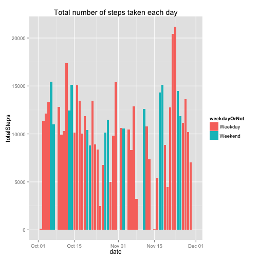
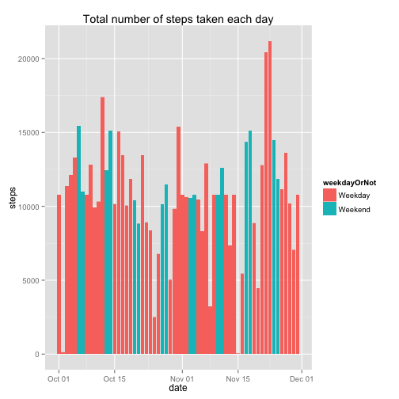
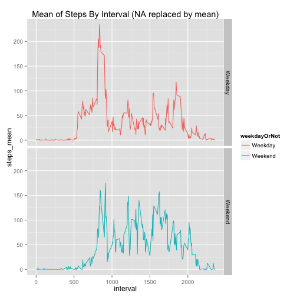

## Loading and preprocessing the data
1.Loading libarays that will be used

```r
library(plyr)
library(ggplot2)
```

2.Loading data from csv

```r
fdata <- read.csv("./activity.csv", header = T)
```

3.Transfer date

```r
rdata <- fdata
rdata$date <- strptime(rdata$date, "%Y-%m-%d")
rdata$weekdayOrNot <- factor(ifelse(!weekdays(rdata$date) %in% c("Saturday", "Sunday"), "Weekday", "Weekend"))
```

```r
totalStepsByDay <- ddply(rdata, .(date, weekdayOrNot), summarize, totalSteps=sum(steps, na.rm=T))
```

```r
meanByInterval <- ddply(rdata, .(interval, weekdayOrNot), summarize, steps_mean=mean(steps, na.rm=T))
```

## What is mean total number of steps taken per day?
### You can see the total number of steps taken each day from this picture

```r
qplot(date, totalSteps, data = totalStepsByDay, geom = "histogram", stat = "identity", fill = weekdayOrNot, main = "Total number of steps taken each day")
```

 

### Let's take a look at the mean and median number

```r
meanOfTotal <- mean(totalStepsByDay$totalSteps, na.rm = T)
medianOfTotal <- median(totalStepsByDay$totalSteps, na.rm = T)
```
The mean of total (9354.2295082) is much smaller than median of total (10395)

## What is the average daily activity pattern?

```r
maxMeanByInterval <- max(meanByInterval$steps_mean)
intervalWithMaxMean <- subset(meanByInterval, subset = steps_mean==maxMeanByInterval, select = interval)[[1]]
g <- ggplot(meanByInterval, aes(interval, steps_mean))
g <- g + labs(title = "Mean of Steps By Interval")
g <- g + geom_point()
g <- g + annotate("text", x = intervalWithMaxMean, y = maxMeanByInterval, label = paste("interval =", intervalWithMaxMean), colour="red", hjust = 0, vjust = 1)
g
```

 

From above picture, we can see interval 835 contains the maximum number of steps, on average across all the days in the dataset.

## Imputing missing values

```r
totalNARowNum <- nrow(rdata[is.na(rdata$steps),])
```

There is 2304 rows with NA steps in the dataset.
### And now we change the NA into mean of steps in the spacify day to see what will happen.

```r
rdata_noNA <- fdata
rdata_noNA <- ddply(rdata_noNA, .(date), mutate, stepsMean=mean(steps, na.rm=T))
rdata_noNA$date <- strptime(rdata_noNA$date, "%Y-%m-%d")
rdata_noNA$steps <- ifelse(is.na(rdata_noNA$steps), rdata_noNA$stepsMean, rdata_noNA$steps)
```

1.Transform data agagin.

```r
rdata_noNA$weekdayOrNot <- factor(ifelse(!weekdays(rdata_noNA$date) %in% c("Saturday", "Sunday"), "Weekday", "Weekend"))
totalStepsByDay_noNA <- ddply(rdata_noNA, .(date, weekdayOrNot), summarize, totalSteps=sum(steps, na.rm=T))
meanByInterval_noNA <- ddply(rdata_noNA, c("interval", "weekdayOrNot"), summarize, steps_mean=mean(steps, na.rm=T))
```

2. Take a look at histogram again.

```r
qplot(date, totalSteps, data = totalStepsByDay_noNA, geom = "histogram", stat = "identity", fill = weekdayOrNot, main = "Total number of steps taken each day")
```

 

3. Calculate the Mean and Median again.

```r
meanOfTotal_noNA <- mean(totalStepsByDay_noNA$totalSteps, na.rm = T)
medianOfTotal_noNA <- median(totalStepsByDay_noNA$totalSteps, na.rm = T)
```

Compare with 9354.2295082 and 10395, after imputing missing value the mean of number of steps taken the day is still 9354.2295082, and median is still 1.0395 &times; 10<sup>4</sup>.

## Are there differences in activity patterns between weekdays and weekends?

```r
g_noNA <- ggplot(meanByInterval_noNA, aes(interval, steps_mean, colour=weekdayOrNot))
g_noNA <- g_noNA + facet_grid(weekdayOrNot ~ .)
g_noNA <- g_noNA + labs(title = "Mean of Steps By Interval (NA replaced by mean)")
g_noNA <- g_noNA + geom_line()
g_noNA
```

 

It seems that people walks a lot in the moring on weekdays. And they walks nearly steps all day.
