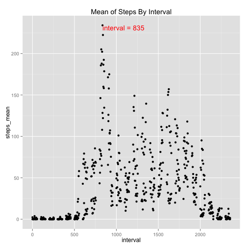

## Loading and preprocessing the data
1.Loading data from csv

```r
rdata <- read.csv("./activity.csv", header = T)
```
2.Transfer date

```r
rdata$date <- strptime(rdata$date, "%Y-%m-%d")
rdata$weekdayOrNot <- factor(ifelse(!weekdays(rdata$date) %in% c("Saturday", "Sunday"), "Weekday", "Weekend"))
```

## What is mean total number of steps taken per day?
### You can see the total number of steps taken each day from this picture

```r
library(ggplot2)
qplot(date, steps, data = rdata, geom = "histogram", stat = "identity", fill = weekdayOrNot, main = "Total number of steps taken each day")
```

```
## Warning in loop_apply(n, do.ply): Removed 2304 rows containing missing
## values (position_stack).
```

 

### Let's take a look at the mean and median number

```r
meanOfTotal <- mean(rdata$steps, na.rm = T)
medianOfTotal <- max(rdata$steps, na.rm = T) / 2
```
The mean of total (37.3825996) is much smaller than median of total (403)

## What is the average daily activity pattern?

```r
library(plyr)
meanByInterval <- ddply(rdata, "interval", summarize, steps_mean=mean(steps, na.rm=T))
maxMeanByInterval <- max(meanByInterval$steps_mean)
intervalWithMaxMean <- subset(meanByInterval, subset = steps_mean==maxMeanByInterval, select = interval)[[1]]
g <- ggplot(meanByInterval, aes(interval, steps_mean))
g <- g + labs(title = "Mean of Steps By Interval")
g <- g + geom_point()
g <- g + annotate("text", x = intervalWithMaxMean, y = maxMeanByInterval, label = paste("interval =", intervalWithMaxMean), colour="red", hjust = 0, vjust = 1)
g
```

 

From above picture, we can see interval 835 contains the maximum number of steps, on average across all the days in the dataset.

## Imputing missing values

```r
totalNARowNum <- nrow(rdata[is.na(rdata$steps),])
```

There is 2304 rows with NA steps in the dataset.
And now we change the NA into mean of total steps to see what will happen.

```r
rdata_noNA <- rdata
rdata_noNA $steps <- ifelse(is.na(rdata_noNA$steps), meanOfTotal, rdata_noNA$steps)
```

```r
qplot(date, steps, data = rdata_noNA, geom = "histogram", stat = "identity", fill = weekdayOrNot, main = "Total number of steps taken each day")
```

 

```r
meanOfTotal_noNA <- mean(rdata_noNA$steps, na.rm = T)
medianOfTotal_noNA <- max(rdata_noNA$steps, na.rm = T) / 2
```

Compare with 37.3825996 and 403, after imputing missing value the mean of total number of steps taken per day is still 37.3825996, and median is still 403.

## Are there differences in activity patterns between weekdays and weekends?

```r
meanByInterval_noNA <- ddply(rdata_noNA, c("interval", "weekdayOrNot"), summarize, steps_mean=mean(steps, na.rm=T))
g_noNA <- ggplot(meanByInterval_noNA, aes(interval, steps_mean, colour=weekdayOrNot))
g_noNA <- g_noNA + facet_grid(weekdayOrNot ~ .)
g_noNA <- g_noNA + labs(title = "Mean of Steps By Interval (NA replaced by mean)")
g_noNA <- g_noNA + geom_line()
g_noNA
```

 

It seems that people walks a lot in the moring on weekdays. And they walks nearly steps all day.
